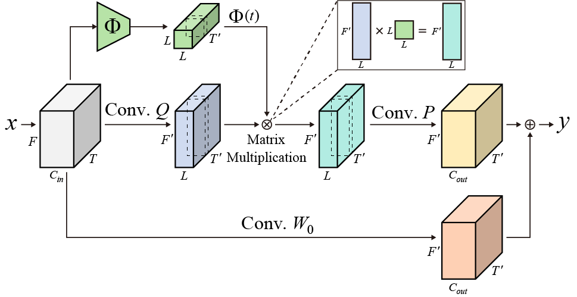

# DTDY-CNN for Text-Independent Speaker Verification

Official implementation of <br>
 - **Decomposed Temporal Dynamic CNN: Efficient Time-Adaptive Network for Text-Independent Speaker Verification Explained with Speaker Activation Map** <br>
by Seong-Hu Kim, Hyeonuk Nam, Yong-Hwa Park @ Human Lab, Mechanical Engineering Department, KAIST<br>
[](https://arxiv.org/abs/2203.15277) 

This code was written mainly with reference to [VoxCeleb_trainer](https://github.com/clovaai/voxceleb_trainer) of paper '[_In defence of metric learning for speaker recognition_](https://arxiv.org/abs/2003.11982)'.

## Decomposed Temporal Dynamic Convolution
<p align="center"></p>
For effective extraction of speaker information from various utterances, we propose decomposed temporal dynamic convolution that applies matrix decomposed adaptive convolution depending on time bins as follows:

$${y}(f,t) =W(t)*x(f,t)$$

$$W(t) ={W}_{0}+P\Phi (t) Q^{T}$$

where $x$ and $y$ are input and output of DTDY-CNN module which depends on frequency feature $f$ and time feature $t$ in time-frequency domain data. 
$W(t)$ is composed of static kernel $W_{0}$ and dynamic residual $P \Phi Q^{T}$, and temporal dynamic matrix $\Phi (t) \in \mathbb{R}^{L \times L}$ is a linear transformation matrix in the $L$-dimensional latent space, and there are different linear transformations for each time bin $t$.

## Requirements and versions used
Python version of 3.7.10 is used with following libraries
- pytorch == 1.8.1
- pytorchaudio == 0.8.1
- numpy == 1.19.2
- scipy == 1.5.3
- scikit-learn == 0.23.2

## Dataset
We used VoxCeleb1 & 2 dataset in this paper. You can download the dataset by reffering to [VoxCeleb1](https://www.robots.ox.ac.uk/~vgg/data/voxceleb/vox1.html) and [VoxCeleb1](https://www.robots.ox.ac.uk/~vgg/data/voxceleb/vox2.html).

## Training
You can train and save model in `exps` folder by running:
```shell
python trainSpeakerNet.py --model DTDY_ResNet34_half --encoder_type ASP --save_path exps/DTDY_CNN_ResNet34
```

This implementation also provides accelerating training with distributed training and mixed precision training.
- Use `--distributed` flag to enable distributed training and `--mixedprec` flag to enable mixed precision training.
  - GPU indices should be set before training : `os.environ['CUDA_VISIBLE_DEVICES'] ='0,1'` in `trainSpeakernet.py`.

### Results:

Network              | #Parm |  EER (%) | C_det |
---------------------|:-----:|:--------:|:---------:|
DTDY-ResNet-34(×0.25) | 3.29M | 1.59 |   0.130   |
DTDY-ResNet-34(×0.50)  | 12.0M | 1.37 |   0.103   |
DTDY-ResNet-34(×0.50)+ASP | 13.6M | **0.96** |   **0.086**   |


## Citation
```bib
@article{kim2022dtdycnn,
  title={Decomposed Temporal Dynamic CNN: Efficient Time-Adaptive Network for Text-Independent Speaker Verification Explained with Speaker Activation Map},
  author={Kim, Seong-Hu and Nam, Hyeonuk and Park, Yong-Hwa},
  journal={arXiv preprint arXiv:2203.15277},
  year={2022}
}
```

Please contact Seong-Hu Kim at seonghu.kim@kaist.ac.kr for any query.

